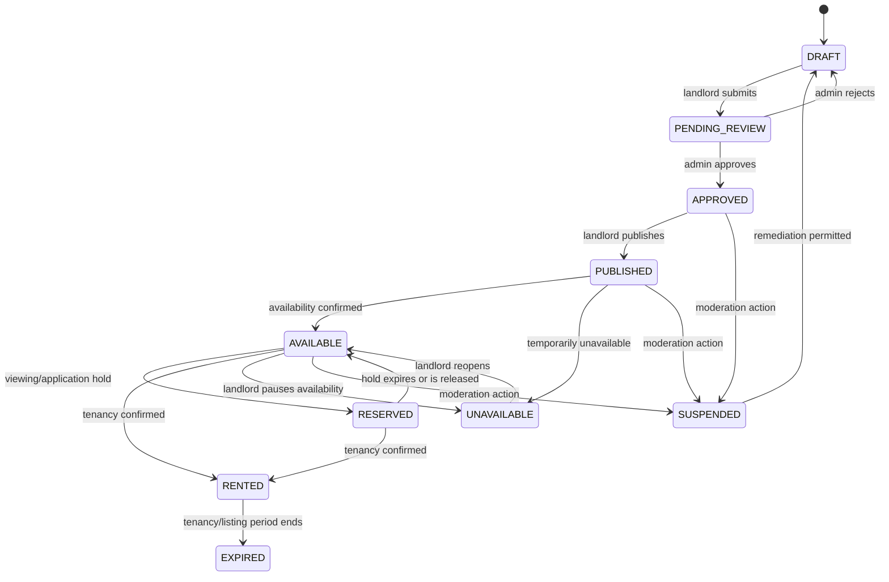
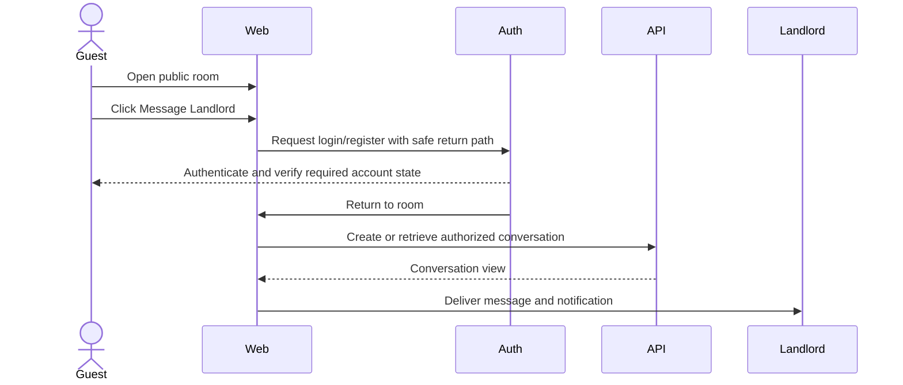
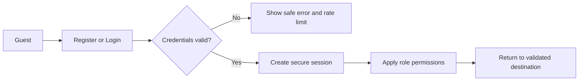
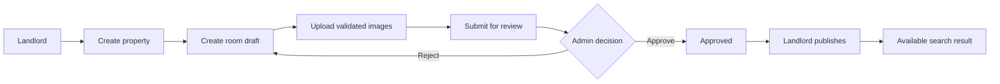
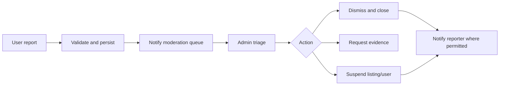
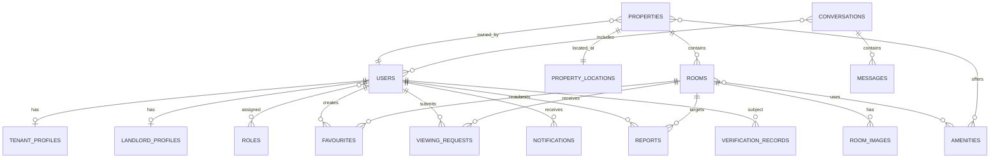
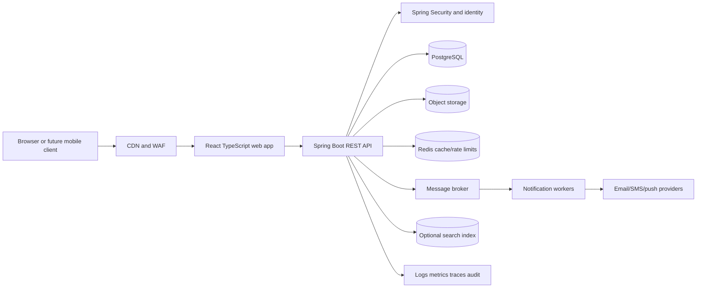

# Room Rental Platform
## Software Requirements Specification and System Design Document

**Document status:** Product and engineering baseline
**Version:** 1.0
**Date:** 2026-09-23
**Working name:** Room Rental Platform
**Primary market:** South Africa
**Currency:** South African Rand (ZAR / R)

> This document defines the target scalable marketplace. The current repository contains a Python/FastAPI MVP that implements a subset of this specification. Items marked **Future**, **Open Decision**, or **Target architecture** must not be represented as available product functionality until implemented and tested.

## 1. Executive Summary

Room Rental Platform is a South African marketplace for discovering and renting rooms. It allows guests to browse freely, search by location and rental criteria, inspect room information and photos, and authenticate only when they need to interact. Authenticated tenants can save rooms, message landlords, request viewings, receive notifications, and report suspicious listings. Landlords can manage properties and rooms, publish listings, communicate with tenants, and manage viewing requests. Administrators moderate users, listings, reports, and platform configuration.

The target system is a modular, API-first product built for gradual growth from an MVP to a multi-tenant marketplace. The preferred production stack is React and TypeScript for the web client, Java and Spring Boot for backend services, PostgreSQL for transactional data, and object storage for images. The design protects exact addresses and other personal information, supports trust and safety workflows, and leaves room for verification, payments, maps, and mobile clients without overloading the MVP.

## 2. Problem Statement

People looking for accommodation in South Africa often search across fragmented channels with inconsistent prices, incomplete room information, unreliable availability, and limited communication history. Landlords have difficulty presenting multiple properties consistently and managing enquiries and viewings. Both sides face scam, privacy, spam, and safety risks.

The platform must make room discovery fast and understandable while preserving a low-friction public browsing experience and creating controls that improve trust over time.

## 3. Proposed Solution

The platform will provide:

- Public, indexed room discovery without mandatory registration.
- Structured property, room, pricing, amenity, availability, and image data.
- A controlled authentication gate for messaging, favourites, viewings, and reports.
- Separate tenant, landlord, and administrator workspaces.
- Moderation and reporting workflows before and after publication.
- Notification abstractions that can later deliver in-app, email, SMS, push, or WhatsApp messages.
- A normalized transactional database and external image storage.
- REST APIs and DTOs that can support a web application, mobile clients, and partner integrations.

## 4. Goals and Objectives

### Goals

1. Help a guest find relevant rooms in under a few minutes.
2. Make total recurring and once-off costs clear before contact.
3. Give landlords an efficient listing and enquiry workflow.
4. Reduce avoidable scams, harassment, and misleading listings.
5. Preserve privacy by showing general locations publicly and exact addresses selectively.
6. Provide a foundation that can scale beyond a simple CRUD listing site.

### Success measures

- Search-to-listing-detail conversion.
- Listing-detail-to-authenticated-contact conversion.
- Median time from landlord registration to first publishable listing.
- Percentage of listings with complete required data and valid images.
- Median response time to tenant enquiries.
- Viewing request acceptance and completion rates.
- Report resolution time and repeat-offender rate.
- Search latency at the agreed percentile.
- Availability and error rates.

## 5. Scope

### In scope for MVP

- Guest browsing and search.
- Province, city, suburb, price, room type, furnishing, and selected amenity filters.
- Listing details, photos, pricing, availability, general location, and landlord information.
- Tenant and landlord registration, login, logout, profile management, and role-based access.
- Landlord properties, rooms, images, publication lifecycle, and availability management.
- Tenant favourites, messaging, viewing requests, notifications, and listing reports.
- Administrator listing moderation, report triage, user suspension, and dashboard statistics.
- Responsive web experience and auditable server-side business rules.

### Out of scope for MVP

Online rent collection, deposits, digital leases, tenant screening, reviews, identity verification, property verification, maps and distance search, AI recommendations, roommate matching, native mobile applications, WhatsApp/SMS delivery, advanced landlord analytics, and full property-management accounting.

### Out of scope unless separately approved

Acting as an estate agent, holding client funds, guaranteeing listings, guaranteeing landlord identity, providing legal advice, or certifying property compliance.

## 6. User Roles

| Role | Description | Core permissions |
|---|---|---|
| Guest | Unauthenticated visitor | Browse, search, filter, sort, view public listing details and general locations |
| Tenant | Authenticated room seeker | All guest actions plus favourites, messages, viewing requests, notifications, reports, profile |
| Landlord | Authenticated listing owner/manager | Manage own profile, properties, rooms, images, publication, messages, viewings, notifications |
| Administrator | Trusted platform operator | Moderate users/listings/reports, manage reference data and settings, audit operations |
| Property Manager | Optional future role | Manage delegated properties without owning the landlord account |

Permissions must be enforced server-side. The frontend may hide unavailable controls, but it is never the authorization boundary.

## 7. Functional Requirements

Requirement priority uses **M** for MVP, **S** for subsequent release, and **F** for future.

| ID | Requirement | Priority |
|---|---|---|
| FR-001 | Guests shall search and view available room listings without an account. | M |
| FR-002 | Search shall support province, city, suburb/area, price range, room type, furnishing, occupancy, and selected amenities. | M |
| FR-003 | Listing results shall support price ascending, price descending, newest, and recently updated sorting. | M |
| FR-004 | A listing shall display photos, price, deposit, fees, availability, room details, amenities, general location, property summary, and landlord public information. | M |
| FR-005 | Restricted actions shall show login/register options and preserve the original listing context. | M |
| FR-006 | Tenants shall save and remove favourite rooms. | M |
| FR-007 | Tenants and landlords shall exchange messages in authenticated conversations. | M |
| FR-008 | Tenants shall request viewings and landlords shall accept, decline, reschedule, or cancel them. | M |
| FR-009 | Users shall report suspicious listings and administrators shall investigate and resolve reports. | M |
| FR-010 | Landlords shall create and manage multiple properties and rooms. | M |
| FR-011 | Landlords shall upload, order, replace, and delete validated room images. | M |
| FR-012 | Administrators shall approve, reject, suspend, and remove listings according to policy. | M |
| FR-013 | The system shall record audit events for security-sensitive and moderation actions. | M |
| FR-014 | Email and phone verification shall be supported. | S |
| FR-015 | Property and identity verification shall be separate workflows. | S/F |
| FR-016 | Online payments, leases, reviews, screening, maps, and mobile applications shall remain extensible future modules. | F |

## 8. Guest Experience

A guest lands on the home page, searches by a South African province, city, suburb, or area, adjusts filters, and opens a listing. The guest may inspect public information without registration. Exact street addresses, private contact details, messaging history, and tenant controls remain unavailable.

When the guest selects Message Landlord, Request Viewing, Save Room, or Report Listing, the system displays an authentication prompt. The return URL must be validated as a local application path to prevent open redirects. After successful authentication, the system returns the user to the original listing and resumes the action where technically safe.

## 9. Tenant Requirements

Tenants shall be able to register, authenticate, manage profile information, search and inspect rooms, favourite rooms, message landlords, request and manage viewings, receive notifications, report listings, and manage account settings. Email and phone verification are target requirements; unverified status must be visible internally and must not be represented as trust certification.

Future tenant capabilities include rental applications, digital agreements, payments, reviews, screening, verification, and rental history.

## 10. Landlord Requirements

Landlords shall maintain personal or business profile information, create multiple properties, add multiple rooms to each property, upload images, define pricing and terms, edit and publish listings, manage availability, respond to messages, manage viewing requests, and receive notifications.

The landlord dashboard shall show properties, room counts, available rooms, rented rooms, pending listings, unread messages, viewing requests, and available performance metrics once event tracking is implemented.

Only the owning landlord or an explicitly delegated property manager may modify a property or room. Administrators may moderate or suspend content but must use auditable privileged actions.

## 11. Property Management

A property contains:

- Name and property type.
- Province, city, suburb, and general location description.
- Private street address and optional coordinates.
- Description, amenities, security features, nearby facilities, and room count.
- Owner, managers, status, timestamps, and audit history.

### Location visibility

| Data | Guest | Authenticated tenant | Landlord/admin |
|---|---|---|---|
| Province/city/suburb | Yes | Yes | Yes |
| General location text | Yes | Yes | Yes |
| Exact street address | No | Only after landlord accepts a viewing or explicitly permits it | Owner/admin according to policy |
| Precise coordinates | No | No by default; only for approved map workflow | Restricted |
| Landlord private phone/email | No | No by default; platform messaging is preferred | Restricted |

The application must not expose exact addresses in HTML, APIs, image metadata, logs, analytics payloads, or search indexes unless the requesting user has the required authorization.

## 12. Room Management

A room shall support name/number, room type, private/shared classification, furnished status, monthly rent in ZAR, deposit, additional fees, availability date, maximum occupants, bathroom type, description, amenities, utilities, rules, images, status, owner, and audit fields.

### Room lifecycle

A rented, suspended, expired, or unavailable room must not appear in available search results. Every transition must be validated against the current state and recorded in an audit event.

## 13. Search and Discovery

Search must be public and use structured fields rather than parsing arbitrary listing text as the primary strategy. MVP filters include province, city, suburb, minimum and maximum monthly rent, room type, shared/private, furnished/unfurnished, occupancy, WiFi, parking, electricity, water, and availability.

### Search architecture

The transactional database is the source of truth. A PostgreSQL query path is sufficient for the initial scale, using composite and selective indexes. When traffic or filtering complexity requires it, an asynchronous projection may feed OpenSearch or Elasticsearch. Search documents must contain only public, approved, currently searchable data.

Recommended indexes include:

- `rooms(status, monthly_rent)`.
- `rooms(room_type, is_shared, is_furnished, status)`.
- `properties(province, city, suburb)`.
- `rooms(available_from)`.
- Join-table indexes for room amenities.
- Full-text or trigram indexes for listing name, suburb, city, and public description.

Price filters must use numeric values, availability must use date-aware logic, and amenity filtering must use normalized relations. Distance sorting is **Open Decision** until a geocoding provider, coordinate policy, and privacy model are approved.

## 14. Room Listing Page

The room page shall contain a responsive photo gallery, title, monthly price in R, deposit, additional fees, availability date, room type, occupancy, furnishing, bathroom, amenities, utilities, rules, description, general location, nearby facilities, property summary, landlord public profile, and explicit trust indicators only where a verification record exists.

Actions are:

- Message Landlord: authenticated tenant only.
- Request Viewing: authenticated tenant only.
- Save Room: authenticated tenant only.
- Share Listing: public, using a canonical URL.
- Report Listing: authenticated user in MVP; anonymous reporting is **Open Decision**.

The page must explain excluded utilities and once-off charges where known. It must not imply that platform content is a guarantee of availability or safety.

## 15. Messaging

A conversation links a room, one tenant, one landlord, participants, messages, timestamps, read state, notification state, and moderation metadata. MVP supports one tenant and one landlord per room conversation. Group conversations and blocking are future or **Open Decision**.

Messages must be authorized by conversation membership, length-limited, normalized for safe rendering, rate-limited, and retained according to the privacy policy. Users must be able to report a conversation; administrators must have controlled access for abuse investigations.

### Authentication flow

## 16. Viewing Requests

A tenant submits a preferred date, preferred time, and optional message. The landlord can accept, decline, suggest another date/time, or cancel. The target status set is `PENDING`, `ACCEPTED`, `DECLINED`, `RESCHEDULED`, `CANCELLED`, and `COMPLETED`.

Notifications:

| Event | Recipient |
|---|---|
| New request | Landlord |
| Accepted | Tenant |
| Declined | Tenant |
| Proposed reschedule | Tenant |
| Reschedule accepted/declined | Both relevant parties |
| Cancelled | Other party |
| Completed | Tenant and landlord, optionally requesting feedback |

An accepted viewing may unlock the exact address according to policy. That policy is **Open Decision** and must consider safety, privacy, and operational needs.

## 17. Favourites

An authenticated tenant may save a room once and remove it later. The uniqueness constraint is `(tenant_id, room_id)`. A favourite may remain visible if a room becomes unavailable, but it must show the current status and must not present the room as bookable. Saved-listing state changes may produce notifications in a later release.

## 18. Notifications

Notifications use a domain event and delivery model. A notification records recipient, event type, title/body, optional target URL, read state, delivery channel, delivery status, and timestamps. Examples include new message, viewing request, viewing decision, listing approval/rejection, report outcome, and room availability changes.

Future channels are email, SMS, push, and WhatsApp. Delivery must be idempotent, retryable, observable, and subject to user preferences and consent requirements.

## 19. Trust, Safety and Reporting

Supported report reasons are suspected scam, fake property, fake photos, incorrect price, incorrect information, duplicate listing, property unavailable, suspicious landlord, harassment, and other.

A report includes reporter, room or user target, reason, details, optional evidence references, status, assigned administrator, resolution, timestamps, and audit events. Suggested statuses are `OPEN`, `TRIAGED`, `IN_REVIEW`, `ACTION_TAKEN`, `DISMISSED`, and `CLOSED`.

Administrators may request evidence, warn users, suspend listings, suspend accounts, resolve reports, and notify reporters. The system must not call a landlord or property verified unless a corresponding verification workflow is complete and current.

## 20. Verification

Verification records must distinguish:

- Email verification: control of an email address.
- Phone verification: control of a phone number.
- Identity verification: identity document and identity-check result.
- Property verification: evidence that a person has a legitimate relationship to a property.

Each record requires subject, verification type, provider or method, status, evidence reference, reviewer, expiry, and audit fields. Identity documents must not be stored in the transactional database as ordinary user fields. They require restricted storage, encryption, retention controls, and access logging.

## 21. Administration

The administrator console shall support users, landlords, properties, rooms, reports, verification queues, and platform settings. Settings include amenities, room types, property types, locations, moderation policies, notification templates, and feature flags.

Dashboard statistics include total users, tenants, landlords, properties, rooms, available rooms, rented rooms, pending listings, reports, messages, and viewing requests. Statistics must define their time window and source query.

Administrative actions require RBAC, audit logging, confirmation for destructive actions, and pagination/search. Administrators must not bypass tenant/landlord data boundaries accidentally through ordinary UI endpoints.

## 22. Business Rules

| ID | Rule |
|---|---|
| BR-001 | Only authenticated landlord accounts or authorized future property managers can create listings. |
| BR-002 | A room must have a valid monthly rent in ZAR and satisfy configured currency/range constraints. |
| BR-003 | A published room must have a valid public location and required property association. |
| BR-004 | A published room must have at least one validated image. |
| BR-005 | Only the owner, delegated manager, or authorized administrator may modify a listing. |
| BR-006 | Tenants must authenticate before messaging, requesting viewings, or saving rooms. |
| BR-007 | Guests may browse publicly available listings without registration. |
| BR-008 | Rented, suspended, expired, and unavailable rooms must not appear as available. |
| BR-009 | Authenticated users may report suspicious listings. |
| BR-010 | Administrators may suspend listings and users with an audit reason. |
| BR-011 | Exact addresses must not be shown to guests. |
| BR-012 | A room may belong to exactly one property at a time. |
| BR-013 | A favourite must be unique per tenant and room. |
| BR-014 | A message must belong to an authorized conversation participant. |
| BR-015 | User-supplied text must be validated and safely rendered. |
| BR-016 | A verification badge may be shown only for a current successful verification record. |
| BR-017 | Listing status transitions must follow the permitted lifecycle. |
| BR-018 | A landlord cannot approve their own listing. |
| BR-019 | Notification delivery must not expose private content to an unauthorized channel. |
| BR-020 | Deleting a user must follow retention, legal hold, and audit policy rather than blindly cascading personal data. |

## 23. User Stories

### Discovery

- As a guest, I want to search by suburb so that I can find accommodation near my preferred area.
- As a guest, I want to filter by monthly rent so that I can stay within my budget.
- As a guest, I want to compare amenities, deposits, and availability so that I can make an informed shortlist.

### Tenant

- As a tenant, I want to save a room so that I can compare it later.
- As a tenant, I want to message a landlord so that I can ask questions before arranging a viewing.
- As a tenant, I want to request a viewing time so that I can inspect the room safely.
- As a tenant, I want to report suspicious information so that the platform can investigate it.

### Landlord

- As a landlord, I want to manage several properties so that my portfolio is organized.
- As a landlord, I want to publish rooms with photos and transparent pricing so that suitable tenants can contact me.
- As a landlord, I want to accept or decline viewing requests so that my schedule remains manageable.

### Administrator

- As an administrator, I want to review pending listings so that unsuitable content does not become public.
- As an administrator, I want to investigate reports and suspend bad actors so that the marketplace remains trustworthy.
- As an administrator, I want to manage reference data so that new amenities and room types do not require a deployment.

## 24. Acceptance Criteria

| Story | Acceptance criteria |
|---|---|
| Guest searches by suburb | Guest can enter a suburb; results match structured location fields; cards show photo, price, and availability; no account is required. |
| Guest opens a listing | Listing shows public gallery, room details, price, fees, availability, amenities, and general location; exact address is hidden. |
| Guest messages landlord | Guest sees login/register prompt; safe return path is preserved; after authentication the guest returns to the listing and can start an authorized conversation. |
| Tenant saves room | Authenticated tenant can save once; duplicate saves do not duplicate rows; saved rooms are listed in the tenant workspace. |
| Tenant requests viewing | Required date/time validation runs; request becomes pending; landlord receives an in-app notification; tenant sees current status. |
| Landlord publishes room | Owner can submit a draft; listing is approved before publication; publish fails without required image/location/price; status is searchable only when available. |
| Admin resolves report | Admin sees reason and evidence metadata; can dismiss or suspend; report receives a resolution; reporter is notified where permitted; action is audited. |

## 25. User Journeys

1. Guest searches by suburb, applies a price filter, sorts by price, and opens a result.
2. Guest inspects photos, pricing, amenities, availability, and general location.
3. Guest clicks Message Landlord and is asked to authenticate.
4. Guest registers as a tenant, returns to the room, and sends a message.
5. Tenant saves a room and later removes it from favourites.
6. Tenant requests a viewing; landlord accepts or proposes another time; both receive notifications.
7. Landlord registers, creates a property, and records public and private location data.
8. Landlord creates a room, uploads images, submits it, and waits for review.
9. Landlord receives an enquiry, replies, and sees unread state clear after opening the conversation.
10. Administrator reviews a report, inspects the listing and evidence, resolves or suspends it, and records the decision.

## 26. System Workflows

### Registration and login

### Listing creation and approval

### Reporting

## 27. Database Design

The production target is normalized PostgreSQL. IDs should use UUIDs or opaque identifiers at API boundaries; the precise key strategy is **Open Decision**. Every mutable business table should include `created_at`, `updated_at`, and, where appropriate, `created_by`, `updated_by`, `version`, and soft-delete or retention fields.

### Core entities

| Entity | Purpose |
|---|---|
| users | Credentials, account status, base identity, timestamps |
| roles | Extensible role definitions |
| permissions | Fine-grained capabilities |
| user_roles | Many-to-many user-role assignment |
| tenant_profiles | Tenant-specific preferences and profile data |
| landlord_profiles | Individual/business landlord data and public profile fields |
| properties | Property ownership, type, status, description |
| property_locations | Public and private location data, coordinates, visibility policy |
| rooms | Room terms, status, price, availability, property relationship |
| room_images | Object-storage references, category, order, primary flag, validation state |
| amenities | Administrator-managed amenity catalog |
| room_amenities | Many-to-many room-to-amenity relationship and optional value |
| property_amenities | Many-to-many property-to-amenity relationship |
| conversations | Conversation metadata and room context |
| conversation_participants | Conversation membership and participant role |
| messages | Message body, sender, read state, moderation state |
| favourites | Tenant-room saved relationship |
| viewing_requests | Requested and negotiated viewing lifecycle |
| notifications | In-app and channel delivery records |
| reports | Trust and safety cases |
| verification_records | Email, phone, identity, and property verification states |
| audit_events | Immutable security, moderation, and business history |
| listing_events | Search/performance events and state transitions |

### Relationships and constraints

- One user may have one tenant profile, one landlord profile, or both where policy permits.
- One landlord owns many properties; each property has one owning account.
- One property has many rooms; each room belongs to exactly one property.
- Rooms and amenities are many-to-many through `room_amenities`.
- Properties and amenities are many-to-many through `property_amenities`.
- A room has many images and exactly zero or one primary image at a time.
- A conversation has many participants and messages; MVP requires one tenant and one landlord.
- A tenant has many favourites; a room may be favourited by many tenants.
- A viewing request belongs to one room and one tenant and resolves through the room's landlord.
- Reports may target a room, user, property, conversation, or message; target types must be explicit and constrained.
- Foreign keys must enforce ownership and deletion behavior. Personal records require retention-aware deletion rather than unsafe cascade.

### Important indexes and constraints

- Unique lower-cased email.
- Unique `(tenant_id, room_id)` favourite.
- Unique room image ordering within a room where required.
- Partial index for searchable statuses.
- Composite location and price indexes.
- Conversation participant and message chronology indexes.
- Notification recipient/read indexes.
- Report status/priority/created indexes.
- Check constraints for non-negative fees, valid status transitions at service level, and valid date ranges.
- Optimistic locking with a version column for concurrent landlord/admin edits.

## 28. ERD Description

## 29. System Architecture

The modular monolith is the recommended first production architecture. Modules share one deployable application and database transaction boundary while maintaining package/API boundaries. Services can be extracted later only where scale or ownership justifies the operational cost.

## 30. Backend Architecture

Preferred stack: Java, Spring Boot, Spring Security, Spring Data JPA, Hibernate, PostgreSQL, Flyway or Liquibase, Bean Validation, and OpenAPI documentation.

Recommended modules:

- Authentication and identity.
- User, tenant, and landlord management.
- Property and room management.
- Search and discovery.
- Images and object-storage integration.
- Messaging and conversations.
- Viewing requests.
- Favourites.
- Notifications.
- Reporting and trust/safety.
- Verification.
- Administration and reference data.

Each request follows `Controller -> DTO validation -> Service -> Repository -> Database`. Controllers must not expose JPA entities directly. Services own authorization checks and transactions. Centralized exception handling maps validation, authentication, authorization, conflict, not-found, and rate-limit errors to consistent problem responses.

## 31. Frontend Architecture

Preferred stack: React, TypeScript, Tailwind CSS, a typed API client, and accessible component primitives. Use route-level code splitting and server-state caching for search, listing, messages, and dashboards.

Public pages: home, search, results, room details, login, register.

Tenant pages: dashboard, profile, saved rooms, messages, viewing requests, notifications, settings.

Landlord pages: dashboard, profile, properties, add/edit property, rooms, add/edit room, image management, messages, viewing requests, notifications, settings.

Admin pages: dashboard, users, landlords, properties, rooms, reports, verification, reference data, settings.

The UI must be mobile-first, keyboard accessible, responsive, clear about prices and fees, and explicit about which actions require authentication. Loading, empty, error, suspended, unavailable, and permission-denied states are required for every data-driven page.

## 32. API Specification

All APIs are versioned under `/api/v1`. Responses use consistent JSON envelopes or RFC 9457 problem details. Pagination uses cursor pagination for large collections where practical. Authentication may use secure server sessions or short-lived access tokens with rotating refresh tokens; this is an **Open Decision**.

| Method | Endpoint | Auth | Purpose |
|---|---|---|---|
| POST | `/auth/register` | Public | Create tenant or landlord account; validate email, password, role |
| POST | `/auth/login` | Public | Authenticate and create secure session/token |
| POST | `/auth/logout` | Authenticated | Revoke current session |
| POST | `/auth/verify-email` | Authenticated/token | Confirm email token |
| GET | `/users/me` | Authenticated | Return current safe profile |
| PATCH | `/users/me` | Authenticated | Update allowed profile fields |
| GET | `/search/rooms` | Public | Filter and sort public searchable rooms |
| GET | `/rooms/{roomId}` | Public | Return public listing detail |
| POST | `/landlords/me/properties` | Landlord | Create property |
| GET | `/landlords/me/properties` | Landlord | List owned/managed properties |
| PATCH | `/landlords/me/properties/{id}` | Landlord | Update authorized property |
| POST | `/landlords/me/properties/{id}/rooms` | Landlord | Create room draft |
| PATCH | `/landlords/me/rooms/{id}` | Landlord | Update owned room |
| POST | `/landlords/me/rooms/{id}/submit` | Landlord | Submit room for review |
| POST | `/landlords/me/rooms/{id}/publish` | Landlord | Publish approved room |
| POST | `/rooms/{id}/images` | Landlord | Upload validated image using multipart or pre-signed upload |
| DELETE | `/rooms/{id}/images/{imageId}` | Landlord | Delete authorized image |
| POST | `/rooms/{id}/favourite` | Tenant | Save room |
| DELETE | `/rooms/{id}/favourite` | Tenant | Remove saved room |
| GET | `/me/favourites` | Tenant | List saved rooms |
| POST | `/rooms/{id}/conversations` | Tenant | Start/retrieve room conversation and first message |
| GET | `/conversations` | Participant | List conversations |
| GET | `/conversations/{id}/messages` | Participant | List messages |
| POST | `/conversations/{id}/messages` | Participant | Send validated message |
| POST | `/rooms/{id}/viewing-requests` | Tenant | Request viewing |
| GET | `/me/viewing-requests` | Tenant | List tenant requests |
| PATCH | `/landlords/me/viewing-requests/{id}` | Landlord | Accept, decline, reschedule, or cancel |
| GET | `/me/notifications` | Authenticated | List notifications |
| PATCH | `/me/notifications/{id}/read` | Recipient | Mark notification read |
| POST | `/rooms/{id}/reports` | Authenticated | Create report with reason/details |
| GET | `/admin/reports` | Admin | Search and triage reports |
| PATCH | `/admin/reports/{id}` | Admin | Resolve, dismiss, assign, or suspend |
| GET | `/admin/users` | Admin | Search and manage users |
| PATCH | `/admin/users/{id}/status` | Admin | Suspend/activate with reason |
| GET | `/admin/rooms/pending` | Admin | Review pending rooms |
| PATCH | `/admin/rooms/{id}/moderation` | Admin | Approve, reject, suspend, remove |
| GET | `/admin/reference-data/amenities` | Admin | Manage amenity catalog |
| POST | `/admin/reference-data/amenities` | Admin | Add amenity without schema change |

Validation includes required fields, enum values, maximum lengths, numeric ranges, valid dates, ownership, state transitions, image content type and size, and request rate limits. Common errors are `400` validation, `401` unauthenticated, `403` forbidden, `404` not found, `409` state/duplicate conflict, `413` upload too large, `429` rate limited, and `500` unexpected failure.

## 33. Security

- Hash passwords with Argon2id or a current bcrypt configuration; never store plaintext passwords.
- Use secure, HttpOnly, SameSite cookies for browser sessions, or a carefully designed token architecture.
- Enforce RBAC and object-level ownership checks in services.
- Validate and normalize all input; use parameterized queries/JPA parameters.
- Escape output and apply a restrictive Content Security Policy to reduce XSS risk.
- Use CSRF protection for cookie-authenticated browser mutations.
- Restrict CORS to approved origins.
- Apply rate limits to login, registration, password reset, messaging, reporting, and uploads.
- Add account lockout or progressive delays without enabling easy denial of service.
- Validate image magic bytes, decoded format, dimensions, file size, and decompression behavior; strip EXIF metadata and generate safe object keys.
- Store images in private object storage and deliver through signed URLs or an image proxy.
- Add HSTS, secure headers, TLS, dependency scanning, secret management, and vulnerability scanning.
- Record immutable audit events for login anomalies, role changes, moderation, privacy access, and destructive operations.
- Implement secure password reset tokens with expiry, one-time use, and notification.
- Do not log passwords, tokens, identity documents, exact addresses, or full message bodies by default.

## 34. Privacy and POPIA Considerations

The platform processes names, email addresses, phone numbers, messages, addresses, optional identity information, and verification evidence. A qualified South African privacy/legal professional must review the final privacy notice, operator agreements, consent wording, retention schedule, cross-border transfers, and data-subject procedures. This document is not legal advice.

Required design principles:

- Collect the minimum data required for a stated purpose.
- Explain the purpose and lawful basis at collection.
- Separate public profile data from private contact and verification data.
- Restrict access by role and need-to-know.
- Encrypt data in transit and at rest where appropriate.
- Keep an access and modification audit trail for sensitive records.
- Define retention and deletion schedules, including legal holds and fraud evidence.
- Provide processes for access, correction, objection, deletion where applicable, and complaint handling.
- Obtain appropriate consent for optional marketing and non-essential notification channels.
- Conduct privacy and security impact assessments for identity verification, geolocation, analytics, and external providers.

## 35. Non-Functional Requirements

| Area | Target |
|---|---|
| Performance | Public search p95 under 500 ms at agreed baseline load, excluding image transfer |
| Availability | MVP target 99.5%; production target reviewed after traffic and budget data |
| Scalability | Stateless API replicas, shared PostgreSQL, object storage, cache, and queue-ready notifications |
| Reliability | Idempotent mutations where retried, transactional status changes, background retry policy |
| Security | OWASP-aligned controls, dependency scanning, least privilege, auditability |
| Maintainability | Modular code, API contracts, migrations, ADRs, automated tests, code review |
| Accessibility | WCAG 2.2 AA target for core public and authenticated journeys |
| Usability | Mobile-first flows, clear pricing, meaningful empty/error states, low registration friction |
| Observability | Structured logs, metrics, traces, health checks, alerts, audit events |
| Backup | Automated encrypted PostgreSQL backups and object-storage versioning/replication policy |
| Recovery | RPO/RTO targets must be agreed before production launch; restoration drills required |
| Responsive design | Supported mobile, tablet, and desktop breakpoints with no loss of core actions |

## 36. UI/UX Requirements

The product should feel professional, trustworthy, and efficient rather than like a generic classifieds page. Search and pricing must dominate the first interaction. Listing cards should show a real primary image, monthly price, deposit/fee summary where available, location, room type, availability, and key amenities.

The interface must:

- Keep browsing public and explain authentication only at the moment of interaction.
- Use plain South African terminology and ZAR formatting.
- Distinguish monthly rent, deposit, additional fees, and included utilities.
- Show unavailable, rented, suspended, and pending states visibly.
- Support keyboard navigation, labels, focus states, alt text, contrast, and error recovery.
- Avoid exposing private addresses or contact details in previews, sharing metadata, or page source.
- Provide confirmation and undo-safe patterns for destructive actions.
- Include loading, empty, offline/error, and permission states.

## 37. Testing Strategy

### Test levels

- Unit tests for services, validators, state transitions, pricing, authorization policies, and notification rules.
- Repository and migration tests against PostgreSQL.
- Integration tests for authentication, ownership, search, uploads, messaging, viewings, reports, and moderation.
- Contract tests for REST DTOs and error responses.
- Browser/UI tests for guest search, authentication return flow, favourites, messaging, viewing, landlord listing, and admin moderation.
- Security tests for IDOR, CSRF, XSS, SQL injection, upload bypass, rate limiting, session expiry, and privilege escalation.
- Performance tests for search, listing detail, concurrent messages, and image delivery.
- Accessibility tests with automated scans and keyboard/screen-reader review.
- User acceptance tests with South African rental scenarios and realistic ZAR values.

### Example test cases

| ID | Test | Expected result |
|---|---|---|
| T-001 | Guest searches Observatory | Matching public rooms return without login |
| T-002 | Guest opens exact-address URL/API field | Exact address is absent or denied |
| T-003 | Guest clicks save | Authentication prompt preserves safe return path |
| T-004 | Tenant messages another tenant's conversation | `403` and no data leakage |
| T-005 | Landlord publishes room without image | Validation prevents publication |
| T-006 | Admin suspends room | Room leaves search and landlord receives permitted notification |
| T-007 | Upload renamed executable | Content validation rejects it |
| T-008 | Duplicate favourite | One row remains and operation is idempotent |
| T-009 | Rented room search | Room is excluded from available results |
| T-010 | Viewing accepted | Tenant status and notification update transactionally |

## 38. Deployment Architecture

Production deployment should include:

- CDN/WAF and TLS termination.
- React static assets served from CDN or managed web hosting.
- Horizontally scalable Spring Boot API instances.
- Managed PostgreSQL with private networking, backups, replicas as justified, and migration controls.
- Private S3-compatible object storage for room images and restricted verification evidence.
- Redis for rate limits, short-lived cache, and optional session storage.
- Message broker or managed queue for notifications and image processing.
- Email provider and future SMS/push/WhatsApp providers behind an adapter.
- Centralized logs, metrics, traces, alerting, and audit storage.
- CI/CD with tests, security scanning, migration checks, staged deployment, and rollback.

The current repository Docker deployment is suitable for an MVP environment, but SQLite/local uploads must be replaced or backed by persistent managed services before horizontal production scaling.

## 39. Monitoring and Logging

Track request latency, error rates, authentication failures, registration conversion, search latency, database pool health, queue lag, image-processing failures, notification delivery, report queue age, and listing state transitions.

Use correlation IDs across API requests and background jobs. Logs must be structured and redact secrets and sensitive personal data. Alerts should cover availability, elevated authorization failures, database failures, backup failure, suspicious login activity, queue backlog, and storage errors.

## 40. Risks and Mitigation

| Risk | Mitigation |
|---|---|
| Fake listings or rental scams | Moderation, reporting, rate limits, evidence workflow, gradual verification |
| Data breach | Least privilege, encryption, secure headers, scanning, incident response, audits |
| Privacy violation | Public/private data model, access tests, retention policy, legal review |
| Fake landlord accounts | Email/phone verification, future identity/property verification, abuse signals |
| Inaccurate availability | Explicit status management, reminders, stale-listing review, tenant reports |
| Image abuse or malware | Magic-byte validation, re-encoding, size limits, private storage, moderation |
| Spam and harassment | Message limits, block/report controls, moderation, account controls |
| High infrastructure cost | Modular monolith, managed services only where justified, measured scaling |
| Poor search quality | Structured fields, analytics, synonym strategy, relevance review, optional search index |
| Scalability bottlenecks | Indexing, pagination, caching, async notifications, load testing, stateless API |
| Unsafe address disclosure | Separate location table, authorization policy, privacy tests, signed access |
| Operational mistakes | Audit logs, confirmation, least privilege, backups, restore drills |

## 41. MVP

The MVP is complete only when the following are implemented and tested: guest browsing; search and filters; room details; photos; pricing; amenities; availability; tenant and landlord registration; landlord profiles; property and room management; messaging; viewing requests; favourites; notifications; reports; and administrator moderation.

The current Python/FastAPI repository is an MVP implementation baseline. It includes SQLite, local image uploads, seeded demo accounts, public browsing, tenant/landlord/admin flows, messaging, viewings, notifications, reports, and basic moderation. It does not yet satisfy the production target for PostgreSQL, object storage, email/phone verification, configurable reference-data administration, advanced auditability, rate limiting, or the full React/Spring architecture.

## 42. Future Roadmap

### Phase 1: Architecture and database

Confirm domain model, PostgreSQL schema, migration strategy, API versioning, privacy classification, object storage, and ADRs.

### Phase 2: Authentication and users

Implement secure identity, roles, profiles, email verification, session management, password reset, audit events, and account controls.

### Phase 3: Properties and rooms

Implement ownership, delegated management decision, property/room CRUD, image pipeline, lifecycle, and reference data.

### Phase 4: Search and listings

Implement public discovery, structured filters, indexes, SEO-safe listing pages, analytics, and optional search projection.

### Phase 5: Messaging and viewing requests

Implement conversations, notifications, rate limits, viewing negotiation, read state, reporting, and moderation controls.

### Phase 6: Administration and moderation

Implement queues, reports, user controls, listing review, verification foundation, audit views, and configurable settings.

### Phase 7: Security and testing

Complete threat modelling, penetration testing, accessibility testing, performance testing, privacy review, backup drills, and incident response exercises.

### Phase 8: Deployment and monitoring

Deploy staged environments, managed PostgreSQL/object storage, observability, alerts, CI/CD, rollback, and operational runbooks.

Future product features include payments, digital rental agreements, screening, reviews, property and identity verification, maps, recommendations, roommate matching, mobile apps, WhatsApp/SMS, landlord analytics, property-management tools, and rental history.

## 43. Open Decisions

1. Session cookies versus OAuth2/OIDC with access and refresh tokens.
2. UUIDs versus numeric database identifiers exposed through opaque API IDs.
3. Modular monolith versus independently deployed services after MVP scale evidence.
4. Search engine adoption threshold and relevance ranking strategy.
5. Exact-address disclosure after accepted viewing, and whether a safety intermediary is required.
6. Whether anonymous reports are permitted and how abuse is controlled.
7. Whether users may have both tenant and landlord profiles.
8. Property manager role, delegation model, and permission boundaries.
9. Email/SMS provider, delivery regions, cost limits, and consent model.
10. Verification providers, evidence retention, badge rules, and review ownership.
11. Supported image formats, maximum dimensions, retention, and CDN provider.
12. RPO/RTO, availability target, hosting region, and disaster recovery budget.
13. Search radius and geocoding provider for future distance filtering.
14. Listing expiry period and stale-availability reminder policy.
15. Pricing for premium placement or landlord subscriptions, if any.
16. Legal entity, responsible party, POPIA operator agreements, and final privacy wording.

## 44. Glossary

| Term | Meaning |
|---|---|
| Available | A room that is currently eligible to appear as available in search |
| Guest | Unauthenticated user |
| Landlord | User who owns or is authorized to manage property listings |
| Listing | Publicly discoverable room offer and its associated property context |
| MVP | Minimum viable product defined in this document |
| POPIA | Protection of Personal Information Act of South Africa |
| Property | A physical building, house, apartment, residence, or shared accommodation site containing rooms |
| Room | The rentable unit represented by a listing |
| Tenant | Authenticated person seeking or renting accommodation |
| Verification | A completed process proving a narrowly defined fact; not a general safety guarantee |
| Viewing | A scheduled opportunity for a tenant to inspect a property or room |
| ZAR | South African Rand |

## 45. Document Governance

This document is the baseline for product planning, architecture, implementation, QA, and operational readiness. Changes to scope, security, privacy, data ownership, status lifecycles, or public/private visibility require a recorded decision and version update. Requirements must be traced to user stories, acceptance criteria, API contracts, database migrations, tests, and release notes before being marked complete.
